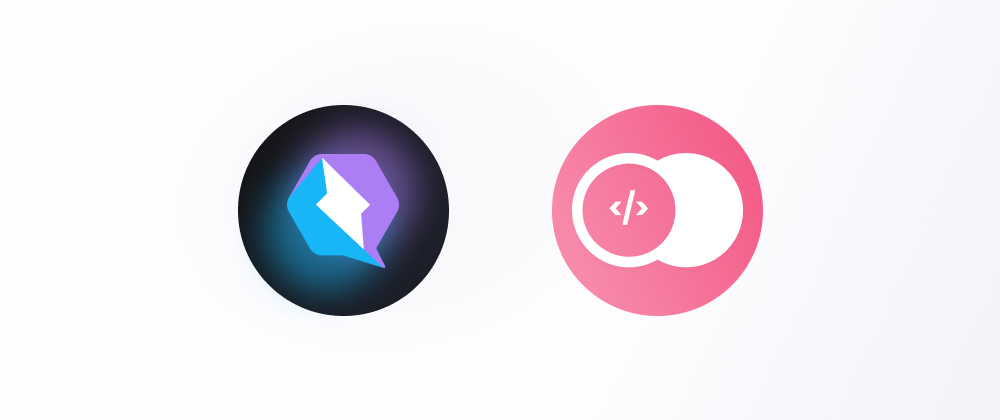
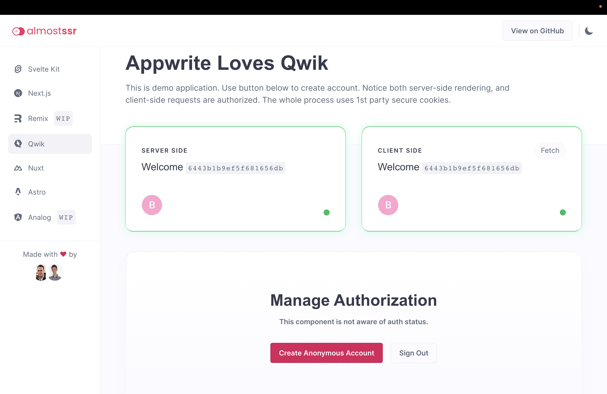
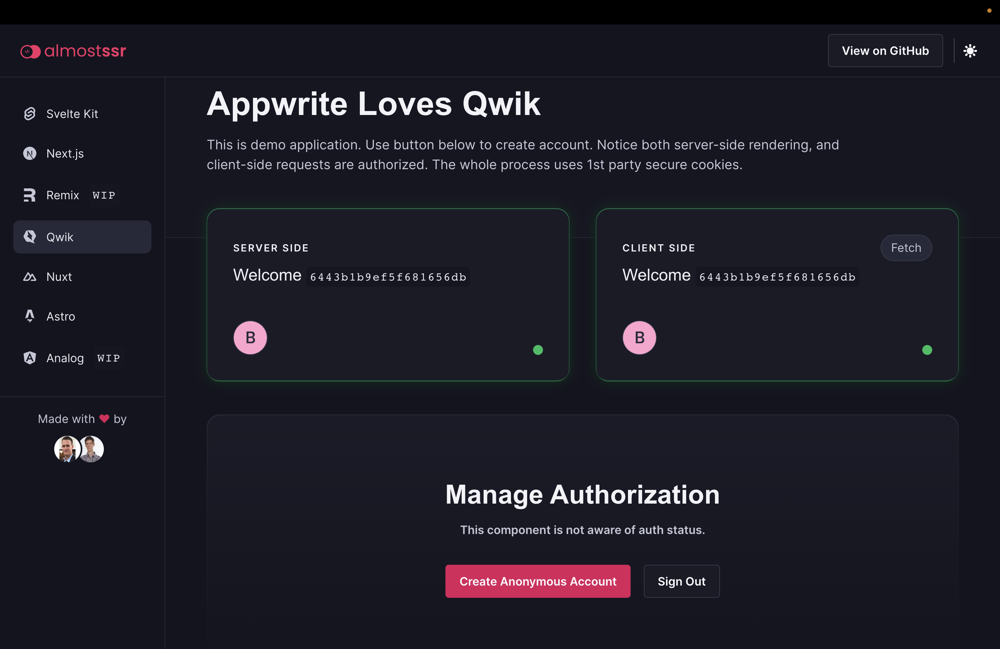
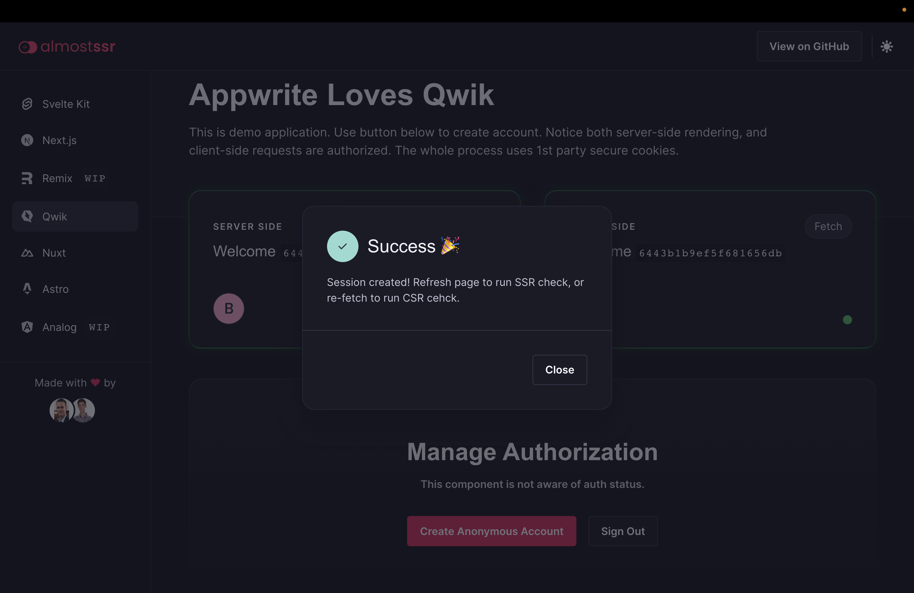

# Almost SSR - Qwik

> Demo application with authorized server-side and client-side rendering.

## 💭 So How Does It Work?

Appwrite uses 1st party secure cookies for authorization. For legacy reasons, there are two such cookies. They are both very similar, but one's name ends with `_legacy` and is configured a tiny bit differently. It's also possible to use a fallback cookie, but that is not secure for production, and we will not be using that.

To ensure server-side rendering works, we need to set those cookies on our SSR server hostname instead of the Appwrite hostname. Let's say our Appwrite instance is on `cloud.appwrite.io`, and our app is on `myapp.com`. SSR server on domain `myapp.com` won't receive `appwrite.io` cookies. This is expected behavior, as browsers keep 1st party cookies securely scoped to specific domains.

To set those cookies on the SSR server, we need a special API endpoint in our SSR server. This endpoint will send a request to create a session, proxying email/password or other credentials. This endpoint next parses the response `set-cookie` header, replaces domain configuration on the cookies, and set's it's own `set-cookie` on the response to the client.

When a client calls this endpoint, the cookie will now be set on the SSR server hostname instead of the Appwrite hostname.

This makes server-side rendering work, but now client-side rendering is broken. Since `set-cookie` coming to the browser only includes a cookie for the SSR server, talking to the Appwrite server directly won't have a proper cookie - there is no auth cookie on the Appwrite hostname. To overcome this problem, we ensure the Appwrite hostname is a subdomain of the SSR hostname. For example, if our SSR server runs on `myapp.com`, Appwrite needs a custom domain configured on `appwrite.myapp.com`. With this setup, all requests to the Appwrite server will include auth cookies, and the user will be properly authorized. This is possible thanks to Appwrite prefixing the cookie domain with `.`, meaning all subdomains can also access the cookie.

## 🧰 Tech Stack

- [Appwrite](https://appwrite.io/)
- [Qwik](https://qwik.builder.io/)
- [Pink Design](https://pink.appwrite.io/)
- [TypeScript](https://www.typescriptlang.org/)

## 🛠️ Setup Server

1. Setup Appwrite server
2. Create project `almostSsr`

## 👀 Setup Client

1. Install libarries `npm install`
2. Update `AppwriteEndpoint` in `src/AppwriteService.ts`
3. Start server `npm run dev`

## 🚀 Deployment

1. Deploy the frontend on your production domain. For example, `myapp.com`.
2. Add the frontend domain as a trusted platform in your Appwrite project.
3. Add a custom domain to your Appwrite project, which is a subdomain of your frontend. For example, `appwrite.myapp.com`.
4. Update `SsrHostname` and `AppwriteHostname` in `src/AppwriteService.ts` with proper domains.

## 🤝 Contributing

To contribute to frontend, make sure to use the [Pink Design](https://pink.appwrite.io/) design system. Ensure both dark and light theme work properly, as well as responsivity on mobile, tablet and desktop.

When contributing with static files, ensure all images are in WEBP or SVG format.

## 🖼️ Screenshots





## 🤖 Auto-generated documentation

- [Qwik Docs](https://qwik.builder.io/)
- [Discord](https://qwik.builder.io/chat)
- [Qwik GitHub](https://github.com/BuilderIO/qwik)
- [@QwikDev](https://twitter.com/QwikDev)
- [Vite](https://vitejs.dev/)

---

## Project Structure

This project is using Qwik with [QwikCity](https://qwik.builder.io/qwikcity/overview/). QwikCity is just an extra set of tools on top of Qwik to make it easier to build a full site, including directory-based routing, layouts, and more.

Inside your project, you'll see the following directory structure:

```
├── public/
│   └── ...
└── src/
    ├── components/
    │   └── ...
    └── routes/
        └── ...
```

- `src/routes`: Provides the directory based routing, which can include a hierarchy of `layout.tsx` layout files, and an `index.tsx` file as the page. Additionally, `index.ts` files are endpoints. Please see the [routing docs](https://qwik.builder.io/qwikcity/routing/overview/) for more info.

- `src/components`: Recommended directory for components.

- `public`: Any static assets, like images, can be placed in the public directory. Please see the [Vite public directory](https://vitejs.dev/guide/assets.html#the-public-directory) for more info.

## Add Integrations and deployment

Use the `npm run qwik add` command to add additional integrations. Some examples of integrations include: Cloudflare, Netlify or Express server, and the [Static Site Generator (SSG)](https://qwik.builder.io/qwikcity/guides/static-site-generation/).

```shell
npm run qwik add # or `yarn qwik add`
```

## Development

Development mode uses [Vite's development server](https://vitejs.dev/). During development, the `dev` command will server-side render (SSR) the output.

```shell
npm start # or `yarn start`
```

> Note: during dev mode, Vite may request a significant number of `.js` files. This does not represent a Qwik production build.

## Preview

The preview command will create a production build of the client modules, a production build of `src/entry.preview.tsx`, and run a local server. The preview server is only for convenience to locally preview a production build, and it should not be used as a production server.

```shell
npm run preview # or `yarn preview`
```

## Production

The production build will generate client and server modules by running both client and server build commands. Additionally, the build command will use Typescript to run a type check on the source code.

```shell
npm run build # or `yarn build`
```

## Vercel Edge

This starter site is configured to deploy to [Vercel Edge Functions](https://vercel.com/docs/concepts/functions/edge-functions), which means it will be rendered at an edge location near to your users.

## Installation

The adaptor will add a new `vite.config.ts` within the `adapters/` directory, and a new entry file will be created, such as:

```
└── adapters/
    └── vercel-edge/
        └── vite.config.ts
└── src/
    └── entry.vercel-edge.tsx
```

Additionally, within the `package.json`, the `build.server` script will be updated with the Vercel Edge build.

## Production build

To build the application for production, use the `build` command, this command will automatically run `npm run build.server` and `npm run build.client`:

```shell
npm run build
```

[Read the full guide here](https://github.com/BuilderIO/qwik/blob/main/starters/adapters/vercel-edge/README.md)

## Dev deploy

To deploy the application for development:

```shell
npm run deploy
```

Notice that you might need a [Vercel account](https://docs.Vercel.com/get-started/) in order to complete this step!

## Production deploy

The project is ready to be deployed to Vercel. However, you will need to create a git repository and push the code to it.

You can [deploy your site to Vercel](https://vercel.com/docs/concepts/deployments/overview) either via a Git provider integration or through the Vercel CLI.
